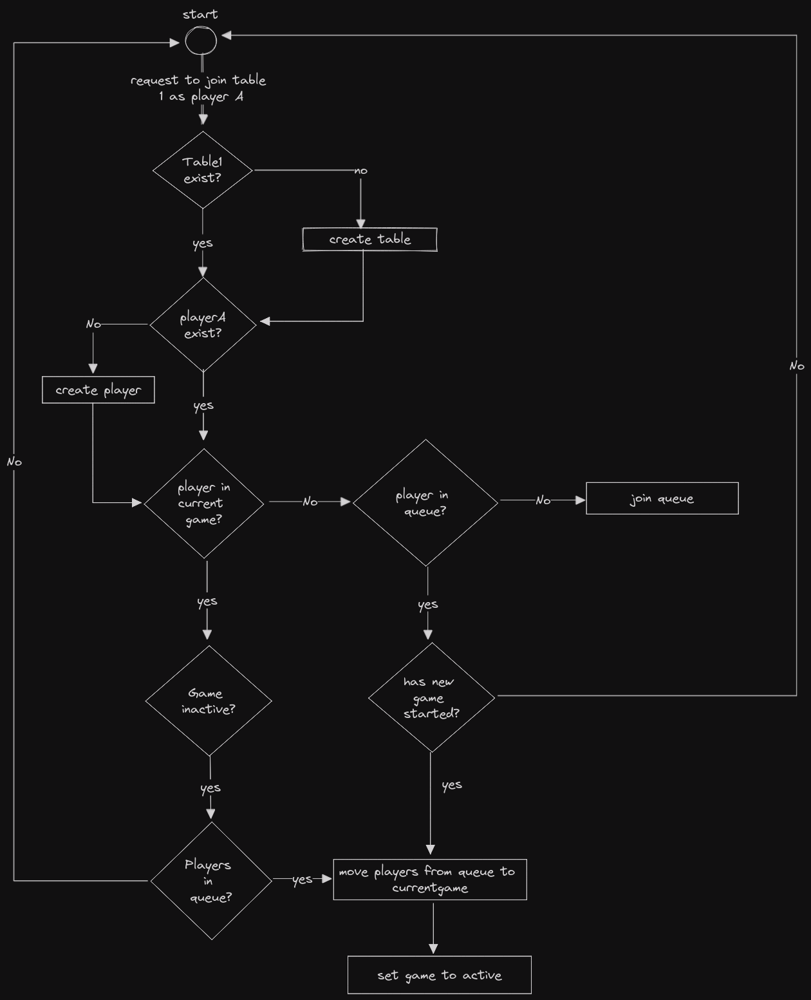

# Reap what you sow

Since we now know what we will be working with we can no go to [excalidraw](https://excalidraw.com) to sketch out a rough control-flow, don't worry about getting it perfect on the first draft, you can move things around :D

Since I don't want to do the whole game at once, I instead opted to think about what happens if I want to start a new game. Nothing exists, only me and my terminal/browser/gui. 

I do not know if the table I want to create/join exists yet, so I need to ask, no idea if my playername exists yet, ask again, is a game currently in progress at that table?, do i have to wait?, are there enough players to start?, etc. 

Long story short, here is my sketch: 

And from this I can now quite literally start writing my program, by going from start (`main()`) to a function called `join_table()` that calls another function called `table_exist()` and so on and so forth until I have fully implemented the process from joining/creating a table/player to being ready to begin the actual game (to be continued in another analysis on game-logic :D)