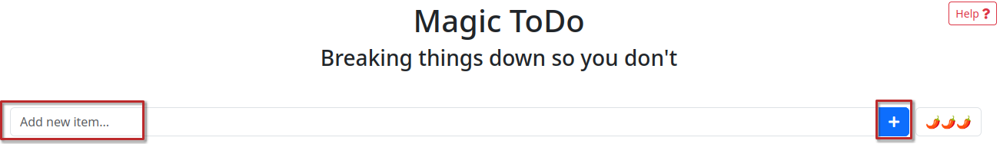
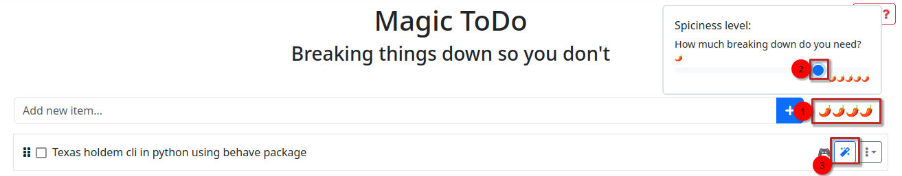
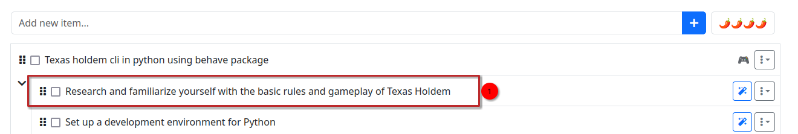

- [Translate a wish into a ToDo](#translate-a-wish-into-a-todo)
  - [Idea](#idea)
  - [Technology](#technology)
  - [ToDo](#todo)
  - [Translating](#translating)


# Translate a wish into a ToDo

## Idea
So here is what we have right now: 
```
program Texas holdem game (cli) 
```

## Technology
```
- I want to use Python to code
- I want to add the "behave" package (reason not relevant for this example)
```

## ToDo
From this we will now formulate a basic todo: 
```
Texas holdem cli in python using behave package
```

Format: **What** in **language** using **packages**

## Translating
Here comes the first use of AI. 
1. Go to [goblin tools](https://goblin.tools)
2. Paste your basic todo and click on **+**


3. Now we set the **spicyness** to **4** and click on the wand


4. The tool has now created more specific tasks, we only care about the first one


And this is our result of this chapter that we take to the next chapter: 
```
## To-Do List
- [ ] Research and familiarize yourself with the basic rules and gameplay of Texas Holdem
```
